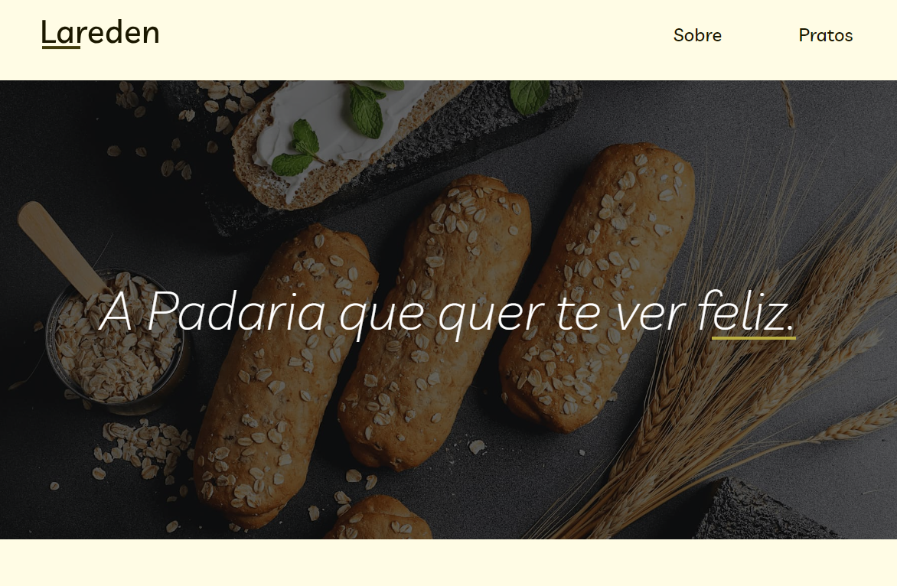

# Lareden :bread:

O Lareden é um projeto fictício de um site de uma padaria, desenvolvido com intuito de aprendizado de responsividade, HTML semântico e estilização com CSS. O objetivo principal foi criar uma estrutura de página web que fosse acessível, amigável para os usuários e visualmente atraente.

Para visualizar clique aqui: [Lareden](https://thiag-o.github.io/lareden/)

Protótipo usado para elaboração do projeto: [Figma](https://www.figma.com/file/cK0QpwoErQ4GTOPEGpBEw2/Lareden?type=design&node-id=0%3A1&mode=design&t=cQAbVNf4wGsFwEzx-1)

## :bookmark_tabs: Instruções

1. Clone este repositório em sua máquina local `git clone https://github.com/thiag-o/lareden.git`.
2. Abra o arquivo `index.html` em seu navegador da web.
3. Explore o site fictício da padaria Lareden, navegando pelas diferentes seções e visualizando o layout responsivo em ação.

## :books: Tecnologias

## Licença

[MIT](https://choosealicense.com/licenses/mit/)
